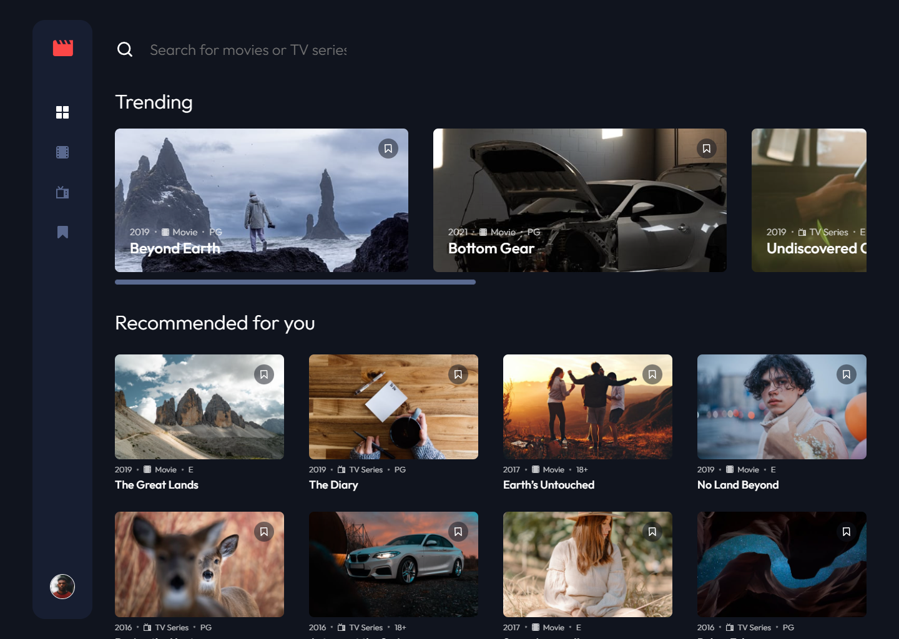
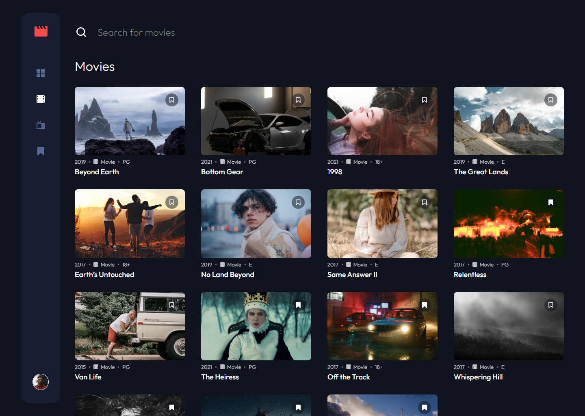
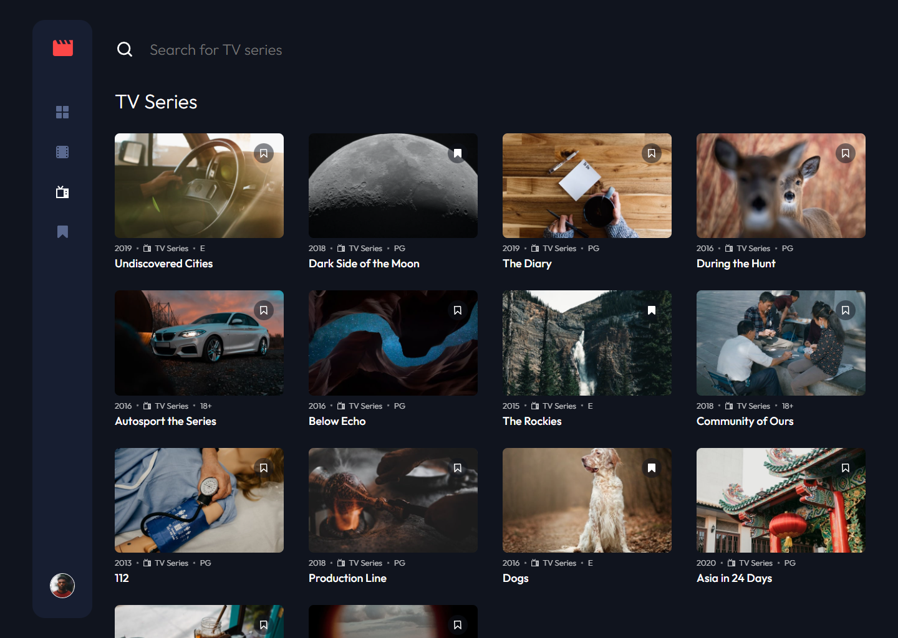
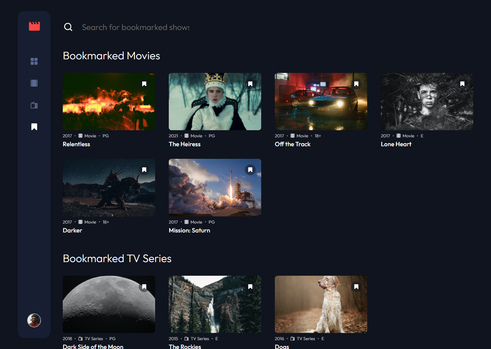
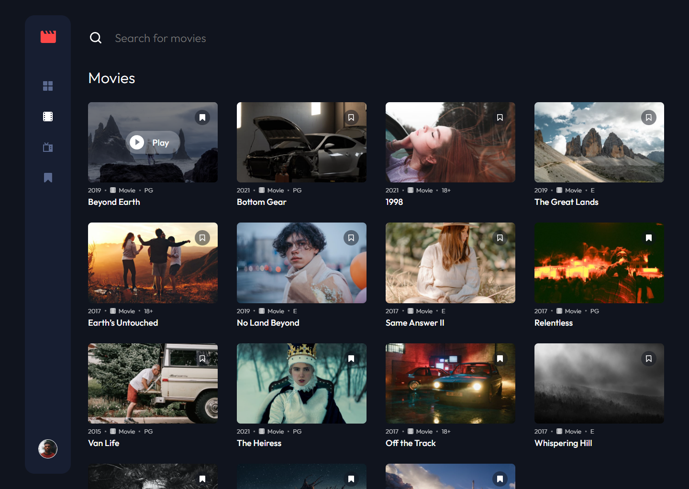
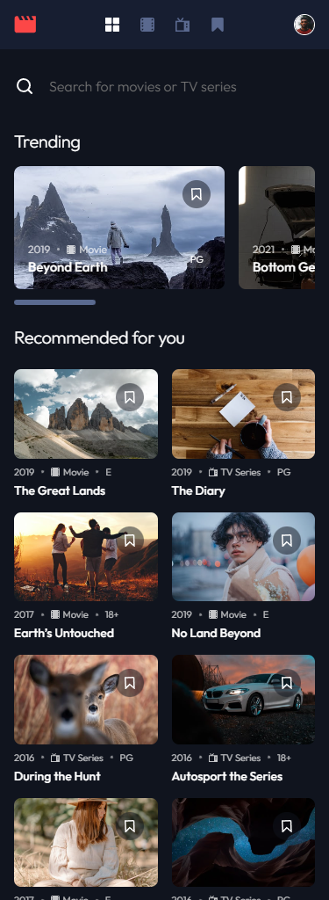
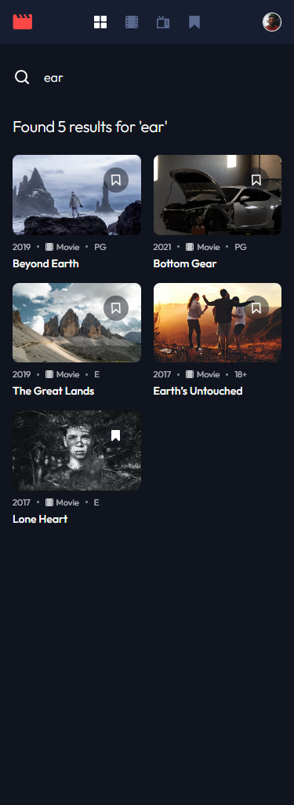

# Frontend Mentor - Entertainment web app solution

This is a solution to the [Entertainment web app challenge on Frontend Mentor](https://www.frontendmentor.io/challenges/entertainment-web-app-J-UhgAW1X). Frontend Mentor challenges help you improve your coding skills by building realistic project.

## Table of contents

- [Overview](#overview)
  - [The challenge](#the-challenge)
  - [Screenshot](#screenshot)
  - [Links](#links)
- [My process](#my-process)
  - [Built with](#built-with)
  - [What I learned](#what-i-learned)
- [Author](#author)

## Overview

### The challenge

Users should be able to:

- View the optimal layout for the app depending on their device's screen size
- See hover states for all interactive elements on the page
- Navigate between Home, Movies, TV Series, and Bookmarked Shows pages
- Add/Remove bookmarks from all movies and TV series
- Search for relevant shows on all pages

### Expected Behaviour

- General (DONE)
  - The navigation menu should be fixed to the left for larger screens. Use the "Desktop - Home" page in the design as a visual reference.
- Home (DONE)
  - The trending section should scroll sideways to reveal other trending shows
  - Any search input should search through all shows (i.e. all movies and TV series)
- Movies (DONE)
  - This page should only display shows with the "Movie" category
  - Any search input should search through all movies
- TV Series (DONE)
  - This page should only display shows with the "TV Series" category
  - Any search input should search through all TV series
- Bookmarked Shows (DONE)
  - This page should display all bookmarked shows from both categories
  - Any search input should search through all bookmarked shows

### Screenshot











### Links

- Solution URL: (https://www.frontendmentor.io/solutions/responsive-entertainment-web-app-built-w-react-hduDxYwDit)
- Live Site URL: (https://lm-entertainment-app.netlify.app/)

## My process

### Built with

- Semantic HTML5 markup
- CSS custom properties/vars
- Desktop-first workflow
- React
- React Router
- Local Storage
- Local Data

### What I learned

This was my first project back from a little break (finished college, so gave myself a little break). This project was about getting back to my normal level of react which I think I did.

There was two main challenges I faced. Firstly, absolute imports wouldn't work. I wanted to setup absolute imports which I think would have made imports cleaner, easier & more maintainable. Reading tutorials and docs, I followed what they said, which was include a jsconfig.json config file in the root:

```js
{
  "compilerOptions": {
    "baseUrl": "src"
  },
  "include": ["src"]
}
```

I put this in the root, and in src too and still didn't work. Sometimes you have to compromise which is what I did. For a bigger project I'd definitely investigate a lot more to see what the problem would be.

The second thing I leanrt has to do with SVGs. I may have known this before but forgot, not sure. Basically, if you have an SVG with a width/height set on it already but no viewbox it won't scale if you set w/h in CSS like for example:

```css
.some-svg {
  max-width: 20px;
  height: auto;
}
```

You have to add a viewbox with the syntax "0 0 width height", the width and height being the ones that were already on the SVG itself.

## Author

- Website - [Leon Michalak](https://www.leonmichalak.dev)
- Frontend Mentor - [@NinjaInShade](https://www.frontendmentor.io/profile/NinjaInShade)
- Instagram - [@RealProgramming](https://www.instagram.com/realprogramming/)
